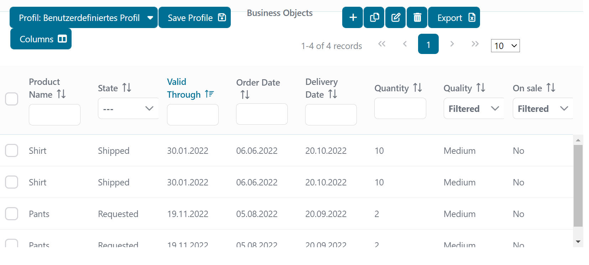

# Stateful Datatable

A utility Dialog to implement a stateful-datatable with Ivy and Primefaces.

## Demo

In this demo, a lazy datatable is listing all the products available in the data base or in the Ivy business repo.



## Setup

 - Before starting, a data base needs to be setup and then generate the schema from the persistence unit.
 - Next, start the test process: `Create Test Data Database` to generate the test data for the demo.

 - If you need to start the stateful-datatable with Ivy business repo, no need to setup the data base but you only need to start the test process: `Create Test Data Repo`.

## How to add a colum:

The place each step takes place has a comment like `Adding columns STEP 1`, `Adding columns STEP 2` and so on.

1. STEP 1 (Product):

Add a field with desired type to the Product, i.e. Date creationDate with getter and setter and annotated with @Column. 

2. STEP 2 (StatefulDatatable.xhtml):

 - Copy a column with the desired type in the StatefulDatatable.xhtml and paste it. 
 - Rename the column id, but it has to have `Column` at the end, i.e. `creationDateColumn`. 
 - Change sortBy and filterBy to target the field in the Product, i.e. `#{product.creationDate}`. 
 - Change header text to show the text you want. Change the value of the custom filter, i.e. `#{data.stateDataTableBean.lazyModel.filterText.get('creationDate')}`.
 - Change output and input values to target the field in the Product, i.e. `#{product.creationDate}`
 - Change exportable and visible values to target the column, i.e. `#{data.stateDataTableBean.lazyModel.columnVisibility.get('deliveryDateColumn')}`
 
3. STEP 3 (ProductDatabaseLazyDataModel and/or ProductRepoLazyDataModel):

 - All these changes happen in either ProductDatabaseLazyDataModel or ProductRepoLazyDataModel based on what storage you use. They will be refered as LazyModel
 - Add filter name as a constant in LazyModel, i.e. `public static final String CREATION_DATE_FILTER = "creationDate";` This constant should have same name as the field.
 
4. STEP 4 (ProductDatabaseLazyDataModel and/or ProductRepoLazyDataModel):

 - In the LazyModel, in load method add call to a method for filtering based on the type of filter and change the parameter of the constant to the one you added,
 	 i.e. for date add `addDateRangeQueryFilter(query, CREATION_DATE_FILTER, filters, false);` in ProductRepoLazyDataModel
 	 or addDateRangeQueryFilter(predicates, cb, root, CREATION_DATE_FILTER, filters, false); in ProductDatabaseLazyDataModel
 	 
5. STEP 5 (ProductDatabaseLazyDataModel and/or ProductRepoLazyDataModel):

 - In the LazyModel, in the updateProduct method, add else if with your constant and setter to the product, ie.

    ```
   
 		else if (field.contains(CREATION_DATE_FILTER)) {
			DateTime dateTime = (DateTime) newObjects.get(0);
			product.setCreationDate(dateTime.toJavaDate());
		}
   
   ```

 - You can also add any validation here
		
6. STEP 6 (StateDataTableBean):

 - If using a dropdown filter, add if else with changed Constant and enum class you are using to the for cycle in getFilterStateFromIUser() method, i.e.

    ```
   
 		else if(ProductRepoLazyDataModel.NEW_ENUM_FILTER.equals(filter.getKey())) {
			setDropdownFilterValue(filter, ((ArrayList<?>) filter.getValue()).size(), NewEnum.class);
		}
   
   ```

 - If usign a date filter, add the Constant to the setDateFilterValue method call to the for cycle in getFilterStateFromIUser() method, i.e.

    ```
   
 		setDateFilterValue(filter, 
				ProductRepoLazyDataModel.VALID_THROUGH_FILTER,
				ProductRepoLazyDataModel.ORDER_DATE_FILTER,
				ProductRepoLazyDataModel.DELIVERY_DATE_FILTER,
				ProductRepoLazyDataModel.CREATION_DATE_FILTER);
   
   ```
