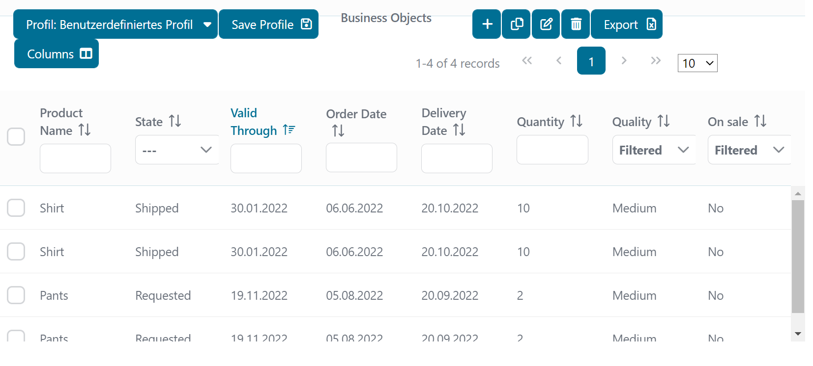

# Stateful Datatable

Ein Utility-Dialog zur Implementierung einer zustandsbehafteten (stateful) Datentabelle mit Ivy und PrimeFaces. Diese Datentabelle zeichnet sich dadurch aus, dass sie ihren Zustand über verschiedene Interaktionen hinweg beibehält. Aktionen wie 

- Sortierung
- Filterung
- Paginierung

bleiben auch nach einem Neuladen der Seite oder dem Wechsel zu einer anderen Ansicht erhalten. Das ermöglicht eine nahtlose und effiziente Nutzung.

## Demo

In dieser Demo wird eine lazy Datentabelle verwendet, um alle verfügbaren Produkte aus der Datenbank oder dem Ivy Business-Repository aufzulisten.



## Setup

- Bevor Du startest, muss eine Datenbank eingerichtet und das Schema aus der Persistence Unit generiert werden.
- Danach starte den Testprozess: `Create Test Data Database`, um die Testdaten für die Demo zu generieren.

- Wenn Du die stateful-datatable mit dem Ivy Business-Repo starten möchtest, musst Du die Datenbank nicht einrichten. Starte einfach den Testprozess: `Create Test Data Repo`.

## Wie man eine Spalte hinzufügt:

Hinweis: Im bereitgestellten Demo-Code ist jeder Schritt mit Kommentaren wie `Adding columns STEP 1`, `Adding columns STEP 2` usw. markiert.

1. **STEP 1 (Product):**

Füge ein Feld mit dem gewünschten Typ zum Produkt hinzu, z.B. `Date creationDate` mit Getter und Setter, und annotiere es mit `@Column`.

2. **STEP 2 (StatefulDatatable.xhtml):**

- Kopiere eine Spalte des gewünschten Typs in die StatefulDatatable.xhtml und füge sie ein.
- Benenne die Spalten-ID um, aber sie muss mit `Column` enden, z.B. `creationDateColumn`.
- Ändere `sortBy` und `filterBy`, sodass sie auf das Feld im Produkt verweisen, z.B. `#{product.creationDate}`.
- Passe den Header-Text an und aktualisiere den Wert des benutzerdefinierten Filters, z.B. `#{data.stateDataTableBean.lazyModel.filterText.get('creationDate')}`.
- Ändere die Ausgabe- und Eingabewerte, sodass sie auf das Feld im Produkt verweisen, z.B. `#{product.creationDate}`.
- Aktualisiere die Werte für `exportable` und `visible`, sodass sie auf die Spalte verweisen, z.B. `#{data.stateDataTableBean.lazyModel.columnVisibility.get('deliveryDateColumn')}`.

3. **STEP 3 (ProductDatabaseLazyDataModel und/oder ProductRepoLazyDataModel):**

- Alle Änderungen erfolgen entweder im `ProductDatabaseLazyDataModel` oder im `ProductRepoLazyDataModel`, abhängig von der verwendeten Speicherart. Sie werden als `LazyModel` bezeichnet.
- Füge den Filter-Namen als Konstante im LazyModel hinzu, z.B. `public static final String CREATION_DATE_FILTER = "creationDate";`. Diese Konstante sollte denselben Namen wie das Feld haben.

4. **STEP 4 (ProductDatabaseLazyDataModel und/oder ProductRepoLazyDataModel):**

- Füge im `LazyModel` in der `load`-Methode einen Aufruf zur Filterung basierend auf dem Filtertyp hinzu und ändere den Parameter der Konstante auf die, die Du hinzugefügt hast, z.B. für ein Datum: `addDateRangeQueryFilter(query, CREATION_DATE_FILTER, filters, false);` im `ProductRepoLazyDataModel` oder `addDateRangeQueryFilter(predicates, cb, root, CREATION_DATE_FILTER, filters, false);` im `ProductDatabaseLazyDataModel`.

5. **STEP 5 (ProductDatabaseLazyDataModel und/oder ProductRepoLazyDataModel):**

- Füge im `LazyModel` in der Methode `updateProduct` ein `else if` mit Deiner Konstante und einem Setter für das Produkt hinzu, z.B.

   ```java
   else if (field.contains(CREATION_DATE_FILTER)) {
      DateTime dateTime = (DateTime) newObjects.get(0);
      product.setCreationDate(dateTime.toJavaDate());
   }
   ```

- Hier kannst Du auch Validierungen hinzufügen.

6. **STEP 6 (StateDataTableBean):**

- Wenn Du einen Dropdown-Filter verwendest, füge ein `if else` mit der geänderten Konstante und der Enum-Klasse, die Du verwendest, zur Schleife in der Methode `getFilterStateFromIUser()` hinzu, z.B.

   ```java
   else if(ProductRepoLazyDataModel.NEW_ENUM_FILTER.equals(filter.getKey())) {
      setDropdownFilterValue(filter, ((ArrayList<?>) filter.getValue()).size(), NewEnum.class);
   }
   ```

- Wenn Du einen Datumsfilter verwendest, füge die Konstante zum Aufruf der Methode `setDateFilterValue` in der Schleife der Methode `getFilterStateFromIUser()` hinzu, z.B.

   ```java
   setDateFilterValue(filter, 
      ProductRepoLazyDataModel.VALID_THROUGH_FILTER,
      ProductRepoLazyDataModel.ORDER_DATE_FILTER,
      ProductRepoLazyDataModel.DELIVERY_DATE_FILTER,
      ProductRepoLazyDataModel.CREATION_DATE_FILTER);
   ```
